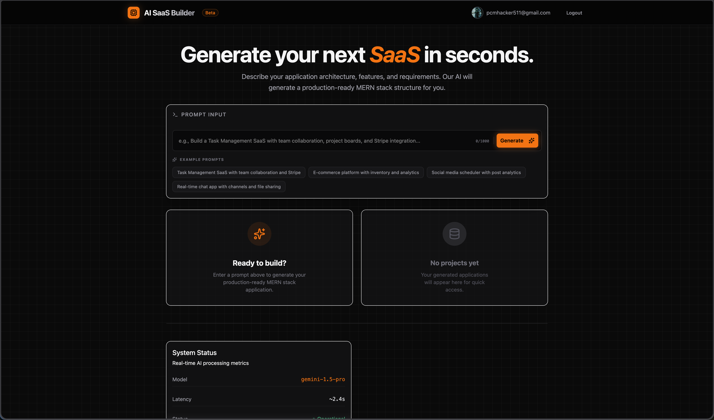
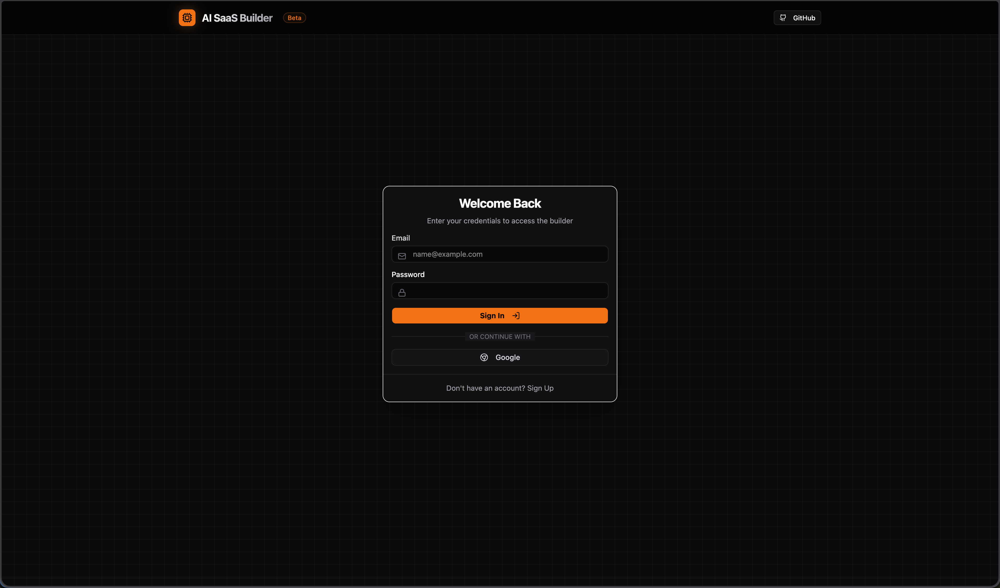

# AI SaaS Builder 🚀

<div align="center">
  
  <br />
  
</div>

AI SaaS Builder is a powerful, production-ready MERN stack application generator. It leverages the **Google Gemini 1.5 Flash** model to turn natural language prompts into comprehensive project architectures, including backend routes, controllers, models, and frontend React components.

## ✨ Features

- **AI-Powered Generation**: Instantly create full-stack application structures from a single prompt.
- **MERN Stack Focus**: Generates code following best practices for MongoDB, Express, React, and Node.js.
- **Project Library**: Save your favorite generations to your personal library, synced in real-time via Firebase.
- **Interactive Preview**: Visualize your generated frontend with a live, interactive task board.
- **Export Options**: Download your entire project as a structured ZIP file or export the raw configuration as JSON.
- **Secure Authentication**: Integrated Google Login via Firebase Authentication.
- **Clean UI**: A modern, dark-themed interface built with Tailwind CSS and shadcn/ui.

## 🛠️ Tech Stack

- **Frontend**: React 18, Vite, Tailwind CSS, shadcn/ui, Framer Motion, Lucide React.
- **AI Engine**: Google Gemini 1.5 Flash (`@google/genai`).
- **Backend/Database**: Firebase (Authentication & Firestore).
- **Utilities**: JSZip (for project exports), Sonner (for notifications).

## 🚀 Getting Started

### Prerequisites

- **Node.js**: Version 18 or higher.
- **Gemini API Key**: Obtain one from the [Google AI Studio](https://aistudio.google.com/).
- **Firebase Project**: Set up a Firebase project with Authentication (Google Provider) and Firestore enabled.

### Installation

1. **Clone the repository**:
   ```bash
   git clone <repository-url>
   cd ai-saas-builder
   ```

2. **Install dependencies**:
   ```bash
   npm install
   ```

3. **Configure Environment Variables**:
   Create a `.env` file in the root directory and add your Gemini API key:
   ```env
   GEMINI_API_KEY=your_gemini_api_key_here
   ```

4. **Firebase Configuration**:
   Ensure your `firebase-applet-config.json` is populated with your Firebase project credentials.

5. **Start the development server**:
   ```bash
   npm run dev
   ```

## 📖 How to Use

1.  **Login**: Sign in securely using your Google account via the integrated Firebase Authentication.
2.  **Describe Your App**: In the main prompt input, describe the SaaS application you want to build. Be specific about features like "Stripe integration", "Team collaboration", or "Real-time chat".
3.  **Use Examples**: If you're stuck, click on one of the **Example Prompts** below the input field to quickly populate a high-quality request.
4.  **Generate**: Click the **Generate** button. The AI will architect a full-stack MERN structure in seconds.
5.  **Review Code**:
    *   **Backend**: Explore routes, controllers, and models.
    *   **Validation**: Review the `zod` schemas generated for API security.
    *   **Frontend**: Check out the React components and pages.
6.  **Copy & Export**:
    *   Use the **Copy** buttons on individual files or **Copy All** to grab entire sections.
    *   Click **Download ZIP** to get a complete project structure ready for local development.
7.  **Save to Library**: Click the **Save** icon to keep the project in your history for future reference.

## 💻 How to Run Locally

1.  **Clone & Install**:
    ```bash
    git clone <repository-url>
    npm install
    ```
2.  **Environment Setup**:
    *   Create a `.env` file.
    *   Add `GEMINI_API_KEY=your_key`.
    *   Ensure `firebase-applet-config.json` contains your Firebase credentials.
3.  **Launch**:
    ```bash
    npm run dev
    ```
    The app will be available at `http://localhost:3000`.

## 👤 Author

**Prakash Chand Meena**

## 📄 License

This project is licensed under the MIT License.
